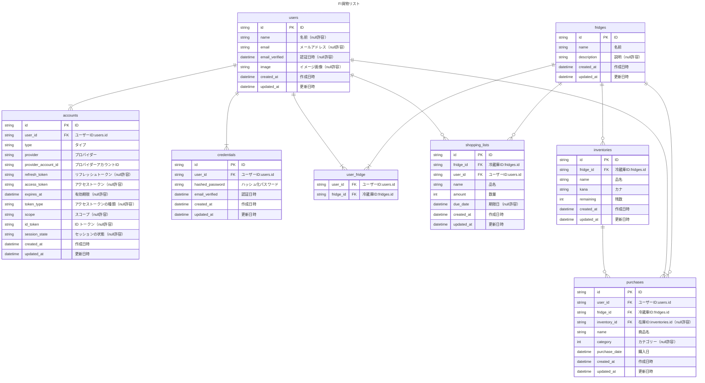

# FI 買物リスト

常備品等の在庫管理ができる買い物リストアプリです。
主に、買物リスト追加、在庫管理追加・編集、購入品追加の 3 つの機能で構成されています。

## デモ

https://fridge-inventory-tau.vercel.app/  
ID:demoUser01  
password:demopassword

## 利用シーン

- 日常的には、買い物リストとして手軽に利用でき、必要に応じて在庫管理や購入商品の登録も可能です。
- 介護の現場では、被介護者・家族（子どもや兄弟）・介護職員など、複数人が関わる冷蔵庫の管理に活用できます。
- 冷蔵庫アカウントを複数作成できるため、「被介護者宅用」「自宅用」など、用途ごとに冷蔵庫を分けて管理することができます。

## 利用の流れ

### 1.ユーザーアカウントを作成

まずは、サービス利用のためのユーザーアカウントを作成します。

### 2.冷蔵庫アカウントを作成

家庭や施設などの単位で管理できる「冷蔵庫アカウント」を作成します。1 ユーザーで複数の冷蔵庫を管理可能です。

### 3.冷蔵庫アカウントのトップページから操作

冷蔵庫アカウントごとのトップページで、以下の操作を行えます：

- 「買い物リスト」の登録・削除
- 「在庫管理」の登録・編集・削除
- 「購入品」の登録・削除

### 4.冷蔵庫アカウントの管理

冷蔵庫アカウント管理画面で以下の操作が行えます：

- 冷蔵庫アカウントの ID や名称、概要を編集
- 他のユーザーを冷蔵庫アカウントに登録

### 5.ユーザーアカウントの管理

ユーザー ID やユーザーアカウント名の編集が行えます。

## 構成・デザイン

https://www.figma.com/design/cuPqO3vASUV9tXxA2tcgJo/FI%E8%B2%B7%E7%89%A9%E3%83%AA%E3%82%B9%E3%83%88-v1

## ER 図

## 使用技術

### フレームワーク・ライブラリ

- Next.js: 15.2.1
- React: 19.0.0
- TypeScript: ^5

### フロントエンド

- Tailwind CSS: ^4
- tailwind-merge: ^3.0.2
- tailwind-variants: ^1.0.0
- clsx: ^2.1.1
- react-hook-form: ^7.54.2
- @hookform/resolvers: ^4.1.3
- zod: ^3.24.2
- react-icons: ^5.5.0
- react-spinners: ^0.15.0

### 認証・認可

- next-auth: ^4.24.11
- @next-auth/prisma-adapter: ^1.0.7
- jsonwebtoken: ^9.0.2

### データベース関連

- Prisma Client: ^6.4.1
- @neondatabase/serverless: ^0.10.4
- @paralleldrive/cuid2: ^2.2.2
- bcryptjs: ^3.0.2

### メール送信

- nodemailer: ^6.10.0

### 外部 API

- Yahoo JAPAN API

### 開発用ツール

- ESLint: ^9
- eslint-config-next: 15.2.1
- @eslint/eslintrc: ^3
- Tailwind CSS (PostCSS plugin): ^4
- Prisma CLI: ^6.4.1
- @types/\*（型定義）  
  @types/react: ^19.0.12  
  @types/react-dom: ^19  
  @types/node: ^20  
  @types/jsonwebtoken: ^9.0.9  
  @types/nodemailer: ^6.4.17
