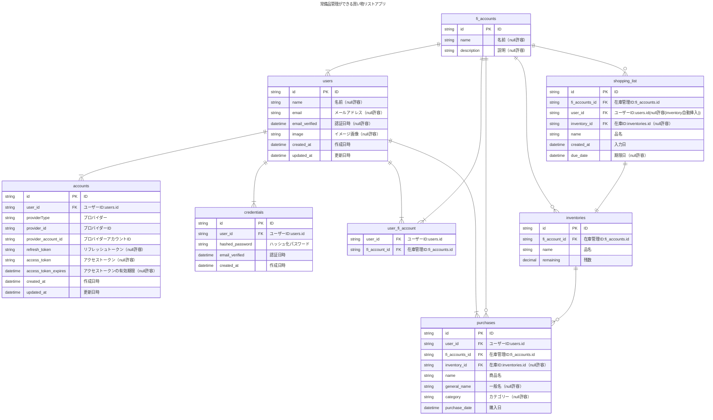

# ER 図

## Fridge Inventory APP データベース

```mermaid
---
title: "常備品管理ができる買い物リストアプリ"
---
erDiagram

    users ||--|{ accounts : ""
    users ||--|{ credentials : ""
    fi_accounts ||--|{ users : ""
    users ||--|{ user_fi_account : ""
    fi_accounts ||--|{ user_fi_account : ""
    inventories ||--o{ purchases : ""
    users ||--|{ purchases : ""
    fi_accounts ||--o{ purchases : ""
    fi_accounts ||--o{ inventories : ""
    fi_accounts ||--o{ shopping_list : ""
    shopping_list ||--|| inventories : ""

    accounts {
        string id PK "ID"
        string user_id FK "ユーザーID:users.id"
        string providerType "プロバイダー"
        string provider_id "プロバイダーID"
        string provider_account_id "プロバイダーアカウントID"
        string refresh_token "リフレッシュトークン（null許容）"
        string access_token "アクセストークン（null許容）"
        datetime access_token_expires "アクセストークンの有効期限（null許容）"
        datetime created_at "作成日時"
        datetime updated_at "更新日時"
    }
    users {
        string id PK "ID"
        string name "名前（null許容）"
        string email "メールアドレス（null許容）"
        datetime email_verified "認証日時（null許容）"
        string image "イメージ画像（null許容）"
        datetime created_at "作成日時"
        datetime updated_at "更新日時"
    }
    credentials{
        string id PK "ID"
        string user_id FK "ユーザーID:users.id"
        string hashed_password "ハッシュ化パスワード"
        datetime email_verified "認証日時"
        datetime created_at "作成日時"
    }
    user_fi_account{
        string user_id FK "ユーザーID:users.id"
        string fi_account_id FK "在庫管理ID:fi_accounts.id"
    }
    fi_accounts {
        string id PK "ID"
        string name "名前（null許容）"
        string description "説明（null許容）"
    }
    inventories {
        string id PK "ID"
        string fi_account_id FK "在庫管理ID:fi_accounts.id"
        string name "品名"
        decimal remaining "残数"
    }
    purchases {
        string id PK "ID"
        string user_id FK "ユーザーID:users.id"
        string fi_accounts_id FK "在庫管理ID:fi_accounts.id"
        string inventory_id FK "在庫ID:inventories.id（null許容）"
        string name "商品名"
        string general_name "一般名（null許容）"
        string category "カテゴリー（null許容）"
        datetime purchase_date "購入日"
    }
    shopping_list {
        string id PK "ID"
        string fi_accounts_id FK "在庫管理ID:fi_accounts.id"
        string user_id FK "ユーザーID:users.id(null許容(inventory自動挿入))"
        string inventory_id FK "在庫ID:inventories.id（null許容）"
        string name "品名"
        datetime created_at "入力日"
        datetime due_date "期限日（null許容）"
    }
```
